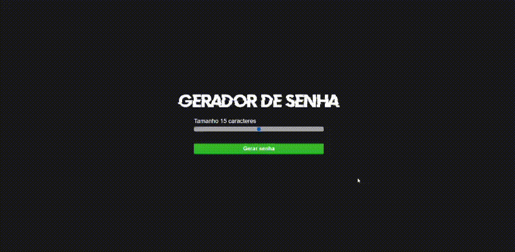

# [Password Generator](https://eduardosucupira.github.io/Password-Generator/).
  

## Project setup
```
npm install
```

### Compiles and hot-reloads for development
```
npm run serve
```

### Compiles and minifies for production
```
npm run build
```

### Lints and fixes files
```
npm run lint
```

### Customize configuration
See [Configuration Reference](https://www.youtube.com/watch?v=i6t2jaRxos4&ab_channel=Sujeitoprogramador).
